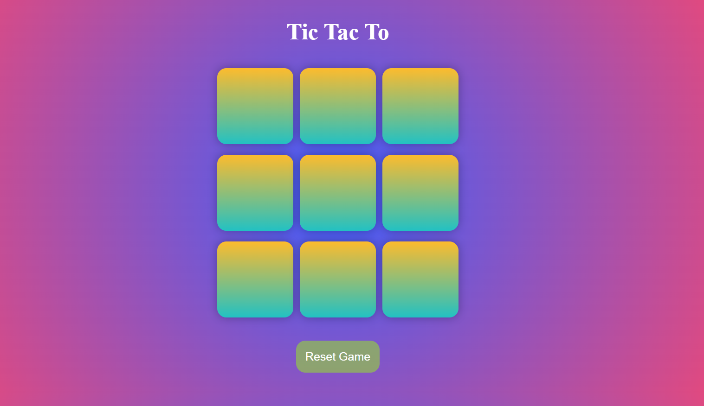

# 🎮 Tic Tac Toe Game  

A simple **Tic Tac Toe** game built with **HTML, CSS, and JavaScript**. Two players can play against each other on the same device by taking turns marking **O** and **X**.  
Live: https://sayan957.github.io/Tic-Tac-To/
---

## 🚀 Features  

- ✅ Two-player gameplay (O vs X)  
- ✅ Winner detection (horizontal, vertical, diagonal)  
- ✅ Draw detection when all 9 cells are filled  
- ✅ Reset and New Game buttons to restart the match  
- ✅ Clean, responsive UI with result messages  

---

## 🛠️ Tech Stack  

- **HTML** → Structure of the game  
- **CSS** → Styling and layout  
- **JavaScript** → Game logic & interactivity  

---

## 📂 Project Structure  

---

## 🎯 How to Play

1. Open the game in your browser.  
2. Player **O** always starts first.  
3. Players take turns clicking on empty boxes.  
4. The first player to align three marks in a row (horizontal, vertical, or diagonal) wins.  
5. If all 9 boxes are filled without a winner, the game ends in a **Draw**.  
6. Use the **Reset** or **New Game** buttons to start fresh.  

---

## 🖼️ Screenshot

---

## 🔮 Future Improvements

- 🤖 Add AI opponent mode  
- ✨ Highlight the winning pattern  
- 🏆 Add scoreboard (track wins/draws)  
- 🔊 Add animations & sound effects  

---

## 📜 License

This project is for **educational purposes**.  
Feel free to use, modify, and share!  
